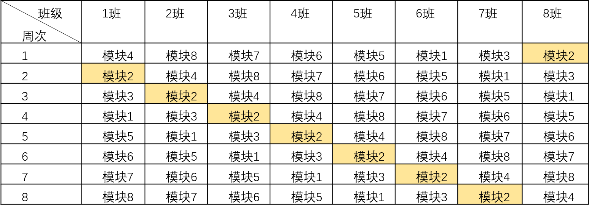

# Advanced Engineering Cognitive Practice

浙江大学工程师学院“”高阶工程认知实践“”课程资料，有clone和download的伙伴请不要忘记右上角点点Star。（๑￫ܫ￩）

* 春季学期课程内容（已完结）
* 夏季学期课程内容（已完结）

```bash
# 克隆项目
git clone https://github.com/Jackey-Marine/Advanced-engineering-cognitive-practice.git

# 初始化子模块（下载引用内容，可选）
cd Advanced-engineering-cognitive-practice
git submodule update --init --recursive
```

## 私人汇总版本（违规立删）

春季学期总计8个实验，本人的具体实验顺序如下表：

| 实验序号 | 时间      |         主题         | 自我实验感受                                                                                                                            |
| :------: | :-------- | :------------------: | --------------------------------------------------------------------------------------------------------------------------------------- |
|    1    | 2023.3.3  |   数字化设计与仿真   | 实验操作繁琐，Plant Sim软件使用感受不佳，但实验指导书介绍详细，基本跟着做就行，验收结果交个报告就行。                                   |
|    5    | 2023.3.10 |  地震测试（三选一）  | 实验较为简单，但课后实验数据处理和报告撰写较为麻烦。                                                                                    |
|    6    | 2023.3.17 |  催化实验（五选一）  | 实验简单，现场以小组为单位提交实验报告，实验时间和操作流程很长（至少20×5mins），机械且重复的工作，做好持久战准备，但实验验收结果较水。 |
|    7    | 2023.3.24 | 工业传感互联与云计算 | 实验简单，耗时短，两人一组，基本照着指导书就能完成操作。                                                                                |
|    8    | 2023.3.29 |   工业系统安全课程   | 实验简单，可课后完成，耗时2h左右，照着指导书就能完成操作，总计8个实验。                                                                 |
|    4    | 2023.4.7  |       电机控制       | 实验简单，指导书清晰，耗时短。                                                                                                          |
|    2    | 2023.4.14 |  工程样品设计与制造  | 实验分两块，螺丝刀设计和3D打印，有前人工作借鉴的情况下并不难；最后仅需提交螺丝刀设计技术报告即可。                                      |
|    3    | 2023.4.21 |  工程机械与智能操控  | 实验很有意（e）思（xin），但是过程很麻烦和繁琐，需要课后前往完成具体的码垛任务，实验报告三人一组完成。                                  |

夏季学期还有综合性实验课4次，本人课程记录如下表：

| 时间      | 主题     | 工作                             |
| --------- | -------- | -------------------------------- |
| 2023.4.27 | 阿巴阿巴 | 老师出差没上课，我也不知道要干啥 |
| 2023.5.11 | 课程导入 | 老师上课讲PPT                    |
| 2023.5.18 | 课程简介 | 学长介绍课程，布置大作业         |
| 2023.5.25 | 一组上课 | 签到+参观                        |
| 2023.6.8  | 二组上课 | （不知道啥事情）                 |

### 夏季课程大作业

2023.6.15之前提交一份2000字的调研报告，主题包括：

* 中国与其他国家的自动驾驶技术路线，各自的特点，哪些地方不同，为什么不同，以及具体做法。
* 国家国情政策，不同企业选取的技术路线等等。
* 其他思想。

以 ***姓名-学号*** 命名，提交到[chennuo1@zju.edu.cn](chennuo1@zju.edu.cn)。

## 不同班级课程顺序



## 引用

借鉴了LV.0、Mr.MVP、LSJ、樽博、官阳等同学的春季课程实验报告结果，如有侵权请及时联系。

引用来源：*[https://github.com/Jackey-Marine/References-of-AECP](https://github.com/Jackey-Marine/References-of-AECP)*

## 备注

* 浙江大学工程师学院内部课程资料，自主借鉴使用，请勿大范围外传和商用，违规立删。
* 实验五为三选一实验：地震测试、微电子测试、电气测试三选一。
* 实验六为五选一实验：废气、废液、催化、吸附、平台五选一。
* 实验四由于清明放假，减少了实验量，准确结果请参考引用内容。
* 夏季课程大实验共有5个主题自由选择。
